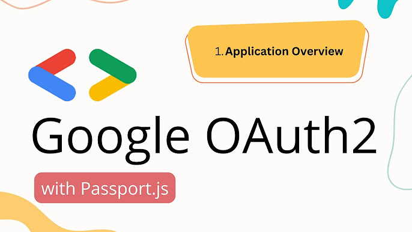

## Autenticação com Goolgle OAuth2 com Passaport JS

Esta app tem como finalidade realizar autenticação com o Google através da biblioteca [Passport JS](https://www.passportjs.org/packages/passport-google-oauth2/),
este módulo permite autenticar usando o Google em seus aplicativos Node.js. Ao conectar-se ao Passport, a autenticação do Google pode ser integrada de maneira fácil e discreta a qualquer aplicativo ou estrutura que suporte middleware estilo Connect , incluindo Express .

## Instalação

Para rodar o projeto deve ter instalado o Node JS e o NPM, rodar o comando npm install, além disso o usuáro deve ter seu próprio GOOGLE_CLIENT_ID e GOOGLE_CLIENT_SECRET,
este  [tutorial](https://help.vtex.com/pt/tutorial/cadastrar-client-id-e-client-secret-para-login-com-google--1lBgDmetUM4goie6mYEOK6) tem o passo a passo de como gerar essas chaves 

## Stack utilizada

**Back-end:** Node, Express, [Passport JS](https://www.passportjs.org/packages/passport-google-oauth2/), [express-session](https://www.npmjs.com/package/express-session)

## 🚀 Sobre mim
Eu sou uma pessoa desenvolvedora full-stack, usando as tecnologias Node JS no Back-end e React no Fron-end, API Restfull e estudando outras tecnologias interessantes e em alta no mercado.

## 🛠 Habilidades
Javascript, HTML, CSS, Node JS, PHP, Spring Boot, Mongo DB, React...

## 🔗 Links

